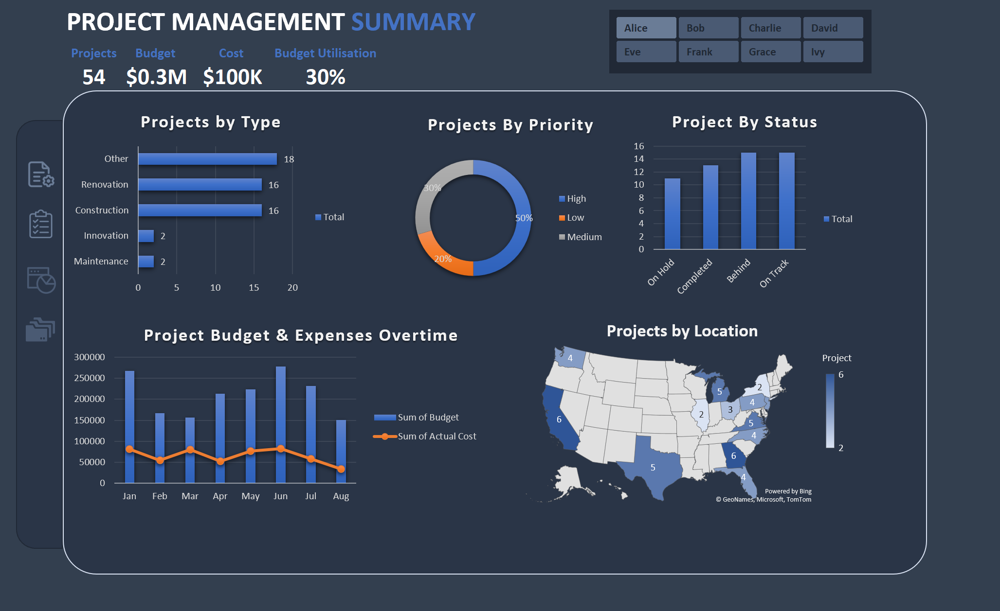
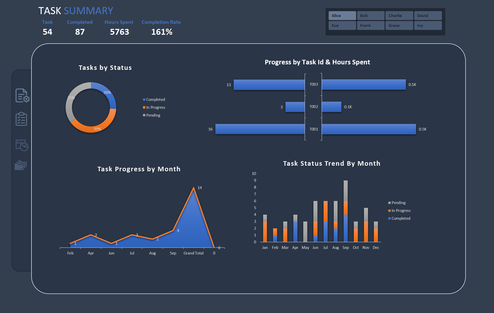

# Project Management Excel Dashboard

This repository contains an interactive **Excel Project Management Dashboard** designed to provide clear visibility over project performance, budget utilisation, costs, and task progress. The dashboard consolidates raw data and analytical outputs into a single, decision-support view.

# Preview

# Key Insights
- Centralised visibility of **54 projects** across multiple dimensions.
- Budget utilisation highlights spending efficiency and cost control.
- Clear breakdown of projects by **type, priority, status, and location**.
- Task analysis reveals completion rates, workload distribution, and monthly trends.
- Early identification of delivery risks through task status tracking.

# Dashboard Overview
The Excel dashboard includes:
- KPI summary (Projects, Budget, Cost, Budget Utilisation)
- Projects by Type, Priority, and Status
- Budget vs Actual Cost over time
- Projects by Location (geographical view)
- Task Summary with completion rate and hours spent
- Monthly task progress and task status trends

All visuals are driven by structured pivot tables and interactive slicers.

# Tools and Techniques
- Microsoft Excel
- Pivot Tables and Pivot Charts
- Excel formulas and calculated fields
- Dashboard design and layout optimisation
- Data cleaning and structuring

# Files in This Repository
- **Project-Management-Excel-Dashboard.xlsx** – Excel file containing raw data, analysis (pivot tables), and dashboard  
- **Project-Management-Excel-Dashboard-1.png** – Dashboard preview image  
- **Project-Management-Excel-Dashboard-2.png** – Additional dashboard preview image  

# Notes
- This is a **sample project** created for learning and portfolio demonstration purposes.
- The dataset used in this project was provided via a publicly shared sample dataset on LinkedIn by **Freedom Oboh**.
- All data is illustrative and does not represent real organisational information.

# Author
**Nelma Cavaleiro**  
Project Management | Data Analytics | MSc Information Systems Management  
GitHub: https://github.com/nelmacavaleiro  
LinkedIn: https://www.linkedin.com/in/nelma-cavaleiro
